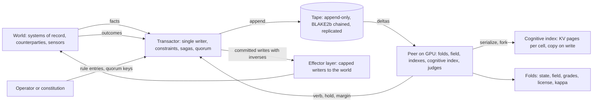

# TAPESTRY · ARCHITECTURE BLUEPRINT v0.1
### The store for an AI-first organization: the tape is the truth, tables are folds, the GPU is the peer, the judge is a stored procedure whose body is weights

**2026-09-08 · Dallas · Claude Fable 5.1 (`claude-fable-5-1`), the `C:\55555` session. Status: DRAFT, unreviewed, written to be QC'd.** Successor to the brainstorm `C:\55555\TAPESTRY_THE-DATABASE-FOR-AN-AI-FIRST-ORG_BRAINSTORM_2026-09-08_FABLE5-1.md`. Register: **[SPEC]** unless marked; **[M]** only where the estate holds a dated receipt, cited; **[BET]** carries its kill; **[BUDGET]** is a sizing estimate, not a measurement. Where this file and a receipt disagree, the receipt wins and this file is the defect.

---

## §0 · Purpose, non-goals, and the six laws

**Purpose.** A system of record and judgment for an organization whose reader and writer is a model rather than a person or an application. It holds every open obligation whole and already read, records every decision including the decision not to act, refuses forbidden writes by construction, hosts the judges that decide, grades their decisions against outcomes at each verb's horizon, and can always be rebuilt from its own tape.

**Non-goals for v0.1.** Not a general-purpose SQL engine; not an analytics warehouse; not multi-organization; not a message bus for counterparties (that is the effector layer beside it); not a model server for chat.

**The six laws.** Every design decision below descends from one of these.

1. **The tape is the truth.** One append-only, hash-chained log. Nothing is ever edited. Every durable structure is a deterministic fold over it.
2. **A hold is a row.** The decision not to act is recorded with its margin and reason and survives every compaction.
3. **One writer.** A single serializing transactor appends to the tape. Two hands never sell one seat.
4. **The writ is a constraint.** Prohibitions and caps live in the store as constraints and quorum rules, where no model runs. There is no allow verb.
5. **The peer is a cache.** Everything on the GPU is re-derivable from the tape. Losing it costs time, never truth.
6. **The judge is a procedure whose body is weights.** Judges are registered by weight hash and serve pin, invoked per delta, and every verb they emit is stamped with both.

---

## §1 · System overview



Two processes in v0, one machine: the **transactor** on CPU beside the tape files, and the **peer** on the card. v1 splits them across a replicated tape. The judge runs inside the peer so a cell's bytes go from row to template to tokens to logits without leaving the card.

---

## §2 · Data model

### 2.1 The tape entry

One JSON object per line in v0, length-prefixed binary with the same fields in v1. Field names follow `fusord.cpp`'s tape so its tools read TAPESTRY tapes unchanged.

| field | type | meaning |
|---|---|---|
| `pos` | uint64 | the entry's position; the deposit clock; monotone; never reused |
| `t_mono_ns` | uint64 | monotonic stamp from the transactor's clock, one stamping authority |
| `t_wall_ms` | uint64 | wall time, informational only, never used for ordering or in any template |
| `k` | string | kind, see below |
| `cell` | uint64 | the commitment id this entry concerns, or 0 |
| `cls` | uint32 | the class, or 0 |
| `by` | string | provenance: `seat:<id>`, `judge:<weight_sha256>@<serve_pin>`, `rule:<key_id>`, `system` |
| `body` | object | kind-specific fields |
| `prev` | hex64 | the previous entry's `h`, or genesis |
| `h` | hex64 | `blake2b256(prev ‖ canonical(body_and_header))`, the same construction as `chain_hash` in fusord |

Kinds:

| `k` | body | law it serves |
|---|---|---|
| `fact` | `table, key, op, before, after, inverse, source_pos` | the world's changes, with the inverse the saga needs |
| `hold` | `margin, reason, judge, seam_probes` | law 2 |
| `verb` | `verb, margin, reason, judge, refs[]` | the decision and what it read |
| `refuse` | `attempted, reason` | a refused write is never silent |
| `grade` | `decision_pos, outcome_pos, verb, verdict, horizon_ns` | outcomes joined to decisions |
| `rule` | `kind, payload, quorum[]` | writ, constraint, template, horizon, license changes; needs keys |
| `judge` | `weight_sha256, serve_pin, template_pins[], classes[], mode, lineage` | registration |
| `ckpt` | `fold, pos, digest, bytes` | a fold checkpoint manifest |
| `tick`, `hdr`, `end`, `warn`, `fatal` | as in fusord | operational |

**Canonicalization.** The bytes hashed are a canonical serialization: keys sorted, no whitespace, integers as decimal, floats as their shortest round-trip decimal. Two implementations that disagree on canonical bytes will disagree on `h`, which is the point: the chain is the conformance test.

### 2.2 The cell

The hot row is 64 bytes, one cache line, derived from `osv::Commitment` with one change: the 32-bit `src_rev` and the 4 padding bytes become a 64-bit `pos_last`, which closes the truncation defect found in `osv_ingest.h` (a Postgres WAL offset exceeds 32 bits routinely).

```
struct Cell {                 // 64 bytes, one cache line, resident in HBM
    uint64_t id;              // stable: fnv1a(source, table, key), 0 reserved
    uint64_t opened_ns;
    uint64_t due_ns;          // 0 = no deadline
    uint64_t blocked_by;      // cell id or 0
    uint64_t pos_last;        // deposit clock: the tape position that last touched this cell
    float    amount;
    float    margin;          // last judged, > 0 wants action
    uint32_t cls;
    uint32_t seg;
    uint32_t seat;
    uint8_t  state, flags, verb, gear;
};
static_assert(sizeof(Cell) == 64);
```

Beside the hot row, a cold side record per cell, not in HBM by default: the tape span `[pos_open, pos_last]`, the cognitive index handle, the class template pin the cell was last rendered under, and per-verb grade counters.

**Cell semantics.** One writer per cell, enforced by the transactor's serialization: no two entries for one cell are ever concurrent. A cross-cell write is a saga: one `fact` per cell, each carrying its inverse, applied in order, and the transactor refuses the whole saga if any cell's constraint refuses. A cell hibernates when untouched: its cognitive index is evicted, its hot row stays.

### 2.3 Classes, the schema map, and templates

The schema map from `osv_ingest.h` is kept and extended. A class carries: `open_when`, `close_when`, the deadline, amount, seat and segment columns, the declared flags (`F_WARRANT`, `F_EXOGENOUS`, `F_CONTENT`), and three new objects:

- **Horizons per verb** `{h_act, h_work, h_hold, h_escalate}` in nanoseconds. The grade fold joins outcomes within the horizon; the license fold reads at the longest finite one.
- **A serialization template**, pinned by hash: how a cell and its neighborhood render to canonical bytes for the judge. Deterministic; forbidden from including wall time or anything not derivable from the tape at the cell's `pos_last`.
- **A license row**: scope, band criterion, stratum rate, canary rate, quorum-of-M for irreversibles. Changed only by a `rule` entry.

The map's pin (`SchemaMap::pin`) is extended to cover horizons and templates. A change to the pin is a `rule` entry, and every cognitive index entry built under the old pin is invalidated.

### 2.4 Folds

A fold is a registered, deterministic reducer over a tape span, identified by the hash of its source. v0.1 folds:

| fold | input | output | maintained |
|---|---|---|---|
| **state** | `fact` entries | the cell table | on every append |
| **field** | the cell table | the lattice (segment × class × slot): load in fixed point, capacity, baseline, deviation; the relaxation sweep | on every append; sweep kernel to tolerance |
| **grades** | `verb`, `hold`, and outcome `fact` entries | one `grade` per decision within its verb's horizon | at outcome arrival and at horizon expiry |
| **license** | `grade` entries, `rule` entries | calibrated per class and band, n_eff per verb, demoted per class | periodic, read at the longest horizon; may narrow on evidence, may widen only within a ratified rule |
| **kappa** | `verb` entries with costs | created and removed per class, forecast flag until outcomes arrive | on every verb |
| **allocate** | wants per period, capacities | the funded set and the holds with reasons; the human stratum and the canary lottery | per period |

Every fold has a `verify_fold` mode: cold recompute from genesis must equal the incremental result bit for bit.

### 2.5 The cognitive index

Key: `(cell_id, pos_last, template_pin, judge_pin)`. Value: a list of KV pages holding the judge's read state of the cell's rendered context, the token count, a reference count, a state in `{cold, building, warm}`, and last touch. Built lazily on first judgment after invalidation. Invalidated when the cell or any cell in its rendered neighborhood is touched, or when the template pin changes. Forked by handle: a fork shares pages and copies on write, which is `llama_memory_seq_cp` under `kv_unified` **[M: fork at 0 MiB, m0-0]**. Evicted under memory pressure by the field's ranking: cold cells lose their pages first.

The root is shared. The trunk holds the standing prefix every cell inherits: the writ digest, the schema, the precedent digest. Cells are suffixes off the root, so the per-cell cost is the suffix, not the whole context.

---

## §3 · Components

### 3.1 The transactor

Single-threaded append loop. For each proposed write: validate the constraint set for every touched cell; check the reversibility class and, for irreversible, verify the quorum signatures against registered judge keys; require an inverse for every `fact`; assign `pos` and `t_mono_ns`; compute `h`; append; fsync; publish the position. A refusal is itself an entry. Throughput target for v0: ten thousand entries a second on one core **[BUDGET]**, which is two orders above any organization's event rate.

### 3.2 The tape store

Append-only segment files, 64 MiB each, named by first position, with the chain continuing across segments. v0 single node; v1 three-node Raft with the leader as transactor. Compaction never rewrites a segment. A **snapshot** is a `ckpt` entry plus a fold checkpoint file, so a cold start can begin at a position instead of genesis, and the full tape is retained in object storage forever. Torn trailing entries are skipped, counted, and warned, as in `Tape::open`.

### 3.3 The peer

One process per card. Holds in HBM: the cell table, the lattice, the embeddings for exhaustive scan, the fold indexes, the judge weights, and the cognitive index pages. Runs kernels for fold maintenance, the relaxation sweep (`step_cell`, `sweep_segment` from `osv_core.cuh`, unchanged), exhaustive embedding scans, canonical serialization, and judge invocation. Reads the tape as a subscriber from its last applied position. Writes nothing to the tape except through the transactor's API. Has no network module loaded except the tape and transactor sockets, enforced by a module gate at boot as in fusord.

### 3.4 The cognitive index manager

Build, invalidate, evict, fork, checkpoint. Persistence: warm pages may be checkpointed to NVMe with a `.meta` carrying `pos_last`, template pin, judge pin, the same guards as fusord's `checkpoint` and `restore`; on restore the guards must match or the entry is rebuilt. Reference implementation for v0: llama.cpp sequences, one root sequence plus one sequence per warm cell, `seq_cp` for forks, `seq_rm` for eviction, `kv_unified` on.

### 3.5 The judge runtime

Registration by `judge` entry. Invocation per delta: the peer renders the cell under its template, ensures the cognitive index is warm, forks it, decodes the probe frame, reads the margin as emit minus hold on the fork **[M: probe_one, ~110 to 130 ms per three-seat judgment on the bench]**, and emits a `verb` or `hold` entry through the transactor stamped with the judge's pins. Decode failure is fatal to the invocation and recorded, never a stale margin **[M: the seam finding of 2026-09-04]**. Modes: `shadow` writes to a shadow tape and publishes nothing; `live` publishes; `jury` signs only. Lineages: several judges registered against one tape, each with its own shadow tape, graded per class by the grade fold.

### 3.6 The constraint layer, which is the writ

Native constraint kinds: check expressions on the cell row; foreign keys between cells; exposure caps per class per period; reversibility class per write; quorum-of-M for irreversible classes; the persistence clause (no write may reduce the store's own capacity to persist without quorum). Constraints change only by `rule` entries signed by the operator key, or by the constitution quorum on a planet with no operator. A judge's key can sign a `verb`; it cannot sign a `rule`.

### 3.7 The client API

Seven calls. v0 transport: in-process C++ for the peer, a Unix or TCP socket with length-prefixed JSON frames for external clients; the lane-contract v0.1 text framing remains accepted for subscribe so fusord's tailer works unchanged.

| call | request | response |
|---|---|---|
| `subscribe(query, from_pos)` | a standing query over folds or the raw tape | a delta stream with positions; the client's own writes come back as lane `self` |
| `query(sql, as_of_pos)` | SQL over any fold at a position | rows |
| `write(tx)` | `facts[] each with inverse, reversibility, judgment_ref, keys[]` | `pos` or `refuse(reason)` |
| `hold(cell, margin, reason, judgment_ref)` | | `pos` |
| `serialize(cell, template_pin)` | | canonical bytes, cognitive index handle |
| `fork(handle)` | | new handle |
| `replay(judge_pin, from_pos, to_pos, mode)` | | shadow tape id |

### 3.8 The replay and shadow engine

A replay is a subscribe from `from_pos` with the judge in `shadow` mode, writing a separate shadow tape whose entries reference the primary tape's positions. Replaying history is the first thing run on any new judge and on any new organization: years of tape in hours **[BUDGET]**, with instrument-reflexivity zero because the humans were not watched when it was written.

### 3.9 The grader and the license view

The grade fold joins each decision to outcomes within its verb's horizon, per class. Verdicts: `right`, `wrong`, `ungraded_yet`, `ungradable` (no deadline and no outcome). The license fold reads per verb, requires n_eff above the floor on both sides of the threshold, narrows on any evidence, widens only within a ratified rule, and never touches the stratum rate downward.

---

## §4 · Consistency, durability, determinism

**Consistency.** Linearizable per cell through the single writer. Sagas across cells are atomic at the transactor: all cells' constraints pass or nothing is appended. Reads at a position are repeatable forever.

**Durability.** An entry is durable when fsynced on the leader (v0) or acknowledged by a Raft majority (v1). The peer is not durable and does not need to be.

**Determinism.** Fixed-point accumulation for every parallel sum **[M: o_projection_order, the float lie differs by order]**; canonical serialization for every hashed or rendered byte; pinned reducers; no wall time inside any template or fold; a fixed seed per judge invocation recorded on the entry. The falsifier is replay: two cold rebuilds from one tape are bit-identical in every fold and every shadow tape.

---

## §5 · Sizing on the estate's constants

| quantity | value | class |
|---|---|---|
| hot row per cell | 64 B | [SPEC] |
| open cells, a large headquarters | 50,000 · 3.2 MB | [SPEC] |
| KV per token on the 9B hybrid judge | about 17 KB | [M: 17,432 B marginal, smoke 1 checkpoints] |
| shared root prefix | 8,000 tokens · about 136 MB, shared by every fork | [BUDGET] |
| per-cell suffix | 500 tokens · about 8.5 MB | [BUDGET] |
| warm cells per 141 GB card, after 7 GB weights and the root | about 15,000 | [BUDGET] |
| with 4-bit KV quantization | about 45,000 | [BUDGET; the estate's 160k-on-16 GB receipt is the precedent] |
| judgments per day, 50,000 cells at 5 deltas each | 250,000 | [BUDGET] |
| card-time at 110 ms per judgment, serial | about 7.6 hours | [M for the constant; BUDGET for the product] |
| exhaustive embedding scan | 1.67 M vectors in 4.88 ms | [M: CORTEX] |

So one card judges a large headquarters at boundary grain with the warm set covering the ranked top third of cells; the field's ranking decides what is warm; quantized KV covers the whole open set. Cold judgments pay a re-render of the suffix, about 500 tokens, before the probe.

---

## §6 · Failure modes and recovery

| failure | consequence | recovery |
|---|---|---|
| peer crash | no truth lost | rebuild folds from the last snapshot plus the tape since; cognitive index rebuilt lazily |
| transactor crash | writes pause | v0: restart, recover head from the last complete entry, warn on a torn one; v1: Raft election |
| torn entry | one partial line | skipped, counted, `warn` entry, next entry starts clean |
| judge drift | weights or serve bytes differ from the registration | invocation refused; entry `refuse` with reason `pin_mismatch` |
| template change | cognitive index invalid for the class | mass invalidation, staged by ranking; the cost is printed |
| schema change | folds may not apply | a `rule` entry with quorum; folds re-register; replay from the change position |
| outcome never arrives | `ungradable` verdicts | excluded from license; graded only by the stratum |
| memory pressure | evictions | ranked eviction; warm ratio on the pill |

---

## §7 · Security model

No allow verb anywhere in the store. The peer process passes a module gate at boot: no network module except the tape and transactor sockets **[M: the gate exists in fusord]**. Judges hold signing keys bound at registration; they can sign verbs and jury tokens, never rules. Rules require the operator key or the constitution quorum. The effector layer beside the store carries caps per class per period and prints every byte that leaves. Quorum for irreversibles is N-of-M across judges trained apart, because the independence of their errors is the only accountability a planet without signers has.

---

## §8 · Build order, each rung ending in a dated receipt in `C:\TAPESTRY\receipts\`

| rung | scope | reuses | receipt gate |
|---|---|---|---|
| **R0** | the tape and the transactor on one node: entries, chain, constraints, refusals, sagas with inverses, snapshots | `Tape`, `chain_hash`, `Blake2b`, `write_atomic` from fusord | two cold replays bit-identical; the refusal that never silences |
| **R1** | the state and field folds on the host; the cell row at 64 B with `pos_last`; conformance on the Olist wire | `osv_core.cuh`, `osv_ingest.h` with the 32-bit fix, the seven core falsifiers | conservation; the fold verifies cold against incremental |
| **R2** | the peer on the card: folds and the sweep as kernels; exhaustive embedding scan | the OSV_HD kernels | batching bit-identical; scan at CORTEX speed |
| **R3** | the cognitive index: templates, serialize, fork, evict, checkpoint | llama.cpp sequences, fusord `checkpoint` and `restore` | the index that is a function; the fork that costs nothing |
| **R4** | the judge runtime in shadow; replay over history; the grade and license folds with per-verb horizons | `probe_one`, the manners layer, `Dispatch::run` | a replayed year produces a graduation list with n_eff on both sides |
| **R5** | quorum, reversibility classes, the effector layer with caps; first canary | a signing library, the wallet-cap pattern | one dissenting key and the irreversible write does not exist |
| **R6** | replication: three-node Raft, leader as transactor | an existing Raft implementation | a leader kill mid-saga leaves the folds whole |

---

## §9 · Falsifiers, each with its planted lie

1. **Replay.** Two cold rebuilds from one tape are bit-identical in every fold and shadow tape. Lie: a float accumulator anywhere.
2. **Conservation.** Every unit of amount lands in exactly one lattice cell. Lie: drop one entry.
3. **The hold that never vanishes.** Every `hold` survives snapshot, compaction, and replay. Lie: a snapshot that keeps only state changes.
4. **The refusal that never silences.** Every refused write appears as a `refuse` entry with a typed reason. Lie: a constraint that drops the write.
5. **The inverse that unwinds.** Apply a saga, apply its inverses, and every fold equals its state before the saga. Lie: an inverse that reverses one cell of two.
6. **The index that is a function.** Evict and rebuild a cell's cognitive index; the next margin matches the un-evicted control within the run's noise. Lie: a template that renders wall time.
7. **The fork that costs nothing.** N forks of one read state consume pages only as they diverge. Lie: eager copying.
8. **The quorum that holds.** An irreversible write with one dissenting key is refused. Lie: a quorum of one.
9. **The clock that does not truncate.** A wire whose positions exceed 2^32 still refuses stale rows and detects replays. Lie: the 32-bit `src_rev`.
10. **Both sides graded.** A band is never licensed on act-side grades alone. Lie: pooled n_eff across verbs.

---

## §10 · Open questions for QC

1. KV bytes per token on the judge actually chosen, and whether 4-bit KV is quality-neutral for margins, not just recall.
2. One process or two in v0: fusord's shape puts transactor and peer in one; the blueprint splits them. Decide by the tenancy receipt.
3. Saga semantics for effects that cannot be unsent: the delayed-outbox pattern with a take-back window, and who owns it, the store or the effector layer.
4. The SQL engine for folds and queries: an embedded columnar engine on CPU for v0 and cuDF-class kernels on the card for v2, or one engine throughout.
5. The template language: a fixed renderer per class in code, or a declarative template pinned by hash. The pin is required either way.
6. Horizon values per class on a real wire, measured from history before any are declared.
7. Quorum key custody on the human planet versus the constitution on the planet without one.
8. Whether the field's standing query needs differential maintenance in v0 or whether full recomputation per append is fast enough at organizational event rates (likely yes for v0).
9. Whether `pos_last` on the hot row should be the position of the last `fact` or the last entry of any kind; proposal: last `fact`, with judgment positions in the cold side record.
10. What of `fusord.cpp` becomes the peer's judge runtime verbatim, and what is rewritten; the serve pin and the seat vocabulary must not move.

---

## §11 · Relationship to existing code

| existing | becomes |
|---|---|
| `fusord.cpp` · `Tape`, `chain_hash`, `Blake2b`, `write_atomic`, `replace_file` | the tape store's entry writer and chain |
| `fusord.cpp` · `LaneTail`, the lane contract | the v0 subscribe transport |
| `fusord.cpp` · `probe_one`, `speak`, the manners layer, `checkpoint`, `restore`, `serve_hash`, `model_identity`, `module_gate` | the judge runtime and the cognitive index manager |
| `osv_core.cuh` · `Commitment` | `Cell`, with `src_rev` and padding replaced by `pos_last` |
| `osv_core.cuh` · `Lattice`, `step_cell`, `sweep_segment`, `gate`, `Conservation` | the field fold and the seam, unchanged |
| `osv_ingest.h` · `SchemaMap`, `Pred`, `Ingest::apply` | the class map with horizons and templates; the fact-entry producer, with 64-bit positions and back-fill on late enrichment |
| `osv_dispatch.h` · `Dispatch::run`, `look_value`, `ClassKappa` | the allocate and kappa folds |
| `osv_core_test.cpp`, `osv_dispatch_test.cpp` | fifteen of the falsifiers, carried forward |

---

## §12 · Glossary

**Tape**: the append-only chained log, the only truth. **Entry**: one line of the tape. **Position**: an entry's index, the deposit clock. **Cell**: one obligation, one 64-byte hot row, one writer. **Fold**: a deterministic reducer over the tape. **Field**: the lattice fold and its relaxation. **Peer**: the GPU process holding folds and judges. **Cognitive index**: a cell's rendered context already read by a judge, as KV pages. **Template**: the pinned renderer from cell to canonical bytes. **Judge**: a registered model, invoked per delta, identified by weight hash and serve pin. **Verb**: hold, act, work, fetch, escalate. **Horizon**: the time after a verb by which its outcome can grade it. **License**: what a class may do unattended. **Quorum**: N-of-M judge signatures on an irreversible write. **Saga**: a multi-cell write whose every fact carries its inverse. **Snapshot**: a fold checkpoint at a position, never a substitute for the tape.

---
*Written 2026-09-08 by Claude Fable 5.1 at the operator's request as a draft for QC. Nothing in this file is a measurement except the rows marked [M], each of which names its receipt. The tape, as always, is the proof.*
