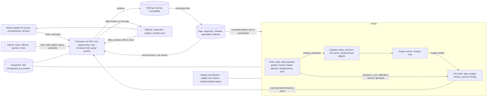

# TAPESTRY · ARCHITECTURE BLUEPRINT v0.2
### The store for an AI-first organization, after the seven-reviewer QC of v0.1

**2026-09-08 · Dallas · Claude Fable 5.1 (`claude-fable-5-1`), the `C:\55555` session. Status: DRAFT v0.2. Supersedes v0.1 for building; v0.1 stands unedited as history.** Seven reviewers read v0.1 against the shipped code and the estate's receipts, compiled the test suites, ran probes on the judge, and filed reports under `C:\TAPESTRY\qc\`. Their adjudication is `C:\TAPESTRY\qc\QC-SYNTHESIS_DECISIONS_v0.1-to-v0.2_2026-09-08_FABLE5-1.md`. Register: **[SPEC]** unless marked; **[M]** only where a receipt names its file; **[R]** read from source or a receipt; **[D]** derived, chain shown; **[BET]** carries its kill; **[BUDGET]** an estimate. Where this file and a dated receipt disagree, the receipt wins and this file is the defect.

---

## §0 · What changed from v0.1, and who found it

| area | v0.1 said | v0.2 says | found by |
|---|---|---|---|
| the laws | six laws | four laws and two corollaries; law 6 was a category error | QC-6 |
| the seam | the judge emits the verb | the judge emits a margin; a named, code-hashed seam is the only author of verbs and holds; the transactor refuses any verb not authored by the seam | QC-6, QC-3, QC-7, QC-4 |
| the chain | canonical JSON, keys sorted | v0 hashes the literal on-disk bytes preceding the prev field, as fusord's chain and verifier do; v1 is a binary deterministic form and restarts the chain | QC-1, QC-7, QC-6 |
| replication | the tape is the Raft log | two artifacts: the Raft log is internal and truncatable; the tape receives only committed entries; positions and hashes are assigned at propose, published at commit | QC-1, QC-5 |
| clocks | monotonic plus informational wall time | three: position for order; a durable transactor-enforced epoch stamp inside the hash for horizons and deadlines; a monotonic reading for durations only, off the entry | QC-1, QC-2, QC-4, QC-6 |
| durability | fsync per entry, 10,000 a second | group commit, one fsync per batch, a p99 latency SLO; the reused writer flushed and never synced | QC-1, QC-5, QC-7 |
| the hot row | 64 bytes with one clock | 128 bytes with three: tape position, source revision, judged-at position | QC-1, QC-2, QC-4, QC-6 |
| the field | maintained on every append by full recompute | differential projection, bit-identical by construction; the sweep per applied batch with a relative tolerance and an iteration cap; ticks drive time; a baseline fold | QC-2, QC-5 |
| the pin | one map pin, extended | per-class pins that cover the predicate operator, the class id, the flags, horizons and templates; a map pin over them | QC-2, QC-7 |
| reversibility | declared by the writer | derived from the pinned class map per class, table and operation; a mismatch is a refusal and a warning | QC-4 |
| grades | a tape kind and a fold output | fold output only; five verdicts; every verb has a horizon, fetch included, escalate has two; grades carry their source | QC-4, QC-2, QC-6 |
| kappa | imported as shipped | act cost from the wire; removed split into forecast and confirmed; demotion on confirmed over a trailing window, not absorbing; a demoted reason; a separate escalation pool | QC-4 |
| the quorum | N-of-M judge keys | on the human planet, irreversibles route to a human signature by the seam; judge quorum is the second key on reversible classes only; registration gated like a rule; independence measured; dissent is a row; signatures bind a named preimage | QC-4, QC-6 |
| the cognitive index | one llama sequence per warm cell, 15,000 warm | a slot pool under the build's cap of 256, cold by default with batched re-derivation, admission by re-touch value, root-only checkpoint, key carries the root pin and the rendered bytes' digest | QC-3, QC-7, QC-1, QC-2 |
| sizing | 15,000 to 45,000 warm cells; years of tape in hours | about 200 warm cells on this build, about 2,100 on an H200 with the cap lifted; a year of tape is about 2,800 card-hours serial; the judge architecture is the first open question | QC-3, QC-7, QC-6, QC-5 |
| the API | seven calls | twelve calls; serialize and fork are the peer's internal ABI; registration and rules have a call; refusals are entries for judgments and counters for protocol faults | QC-5 |
| the effector | committed writes with inverses | the outbox is the tape, the idempotency key is derived from the entry hash, delivery is at-least-once, the inverse of a world effect is a compensation or a retraction | QC-5, QC-6 |
| the process shape | two processes over a socket | two processes; the peer is socketless and keeps fusord's module gate verbatim; the transactor holds the network | QC-5, QC-7 |
| determinism | bit-identical everywhere | three tiers: exact within a pinned tuple, exact and portable for integer folds, bounded with no verb flips for judged folds; a measured noise floor | QC-1, QC-3, QC-6 |
| the planet | mixed | the human planet, stated once; the no-human substitutions in Appendix A | QC-6 |

---

## §1 · The four laws, and two corollaries

1. **The tape is the truth.** One append-only, hash-chained log. Nothing is ever edited. Every durable structure is a fold over it: integer folds re-derive bit for bit; judged folds re-derive within a stated envelope.
2. **A hold is a row.** The decision not to act is recorded with its margin and reason, and the tape is never deleted.
3. **One writer.** A single serializing transactor appends to the tape. Two hands never sell one seat.
4. **The writ is a constraint, and nothing learned disposes.** Prohibitions, caps, reversibility and quorum rules live in the store as constraints where no model runs. There is no allow verb. The judge proposes a margin; a deterministic seam disposes it into a verb.

Corollaries. **The peer is a cache**: everything on the card is re-derivable from the tape, and losing it costs time. **The judge is identified, not trusted**: a registered model with a weight hash, a serve pin and keys, invoked per delta and per period, whose every margin is stamped and whose verbs it never writes.

---

## §2 · System overview



Two processes in v0, one machine. The **transactor** on CPU owns the tape, the Raft log in v1, its own constraint fold, the network, and every socket. The **peer** on the card owns the folds, the cognitive index, the judge runtime and the seam, and holds no socket: it reads committed deltas over a named pipe or a shared-memory ring, and it keeps fusord's module gate verbatim, which forbids the Winsock module on this platform **[R: fusord.cpp, module_gate, FORBIDDEN_MODULES]**.

---

## §3 · Data model

### 3.1 The tape entry

**The v0 wire form.** One JSON object per line, written in a fixed field order, with `prev` and `h` appended last. **The hashed bytes are the literal on-disk bytes of the row preceding `,"prev":"`, byte for byte**, and `h = blake2b256(prev_hex ‖ those bytes)`. That is `chain_hash` in fusord and it is what `verify_chain.py` checks, so the estate's chain receipts and verifier carry over unchanged **[R: fusord.cpp chain_hash, Tape::put; convergence_tools/verify_chain.py]**. There is no canonicalization step in v0 and the word does not appear again in this section. The writer must be total and lossless: every C0 byte and carriage return is escaped, UTF-8 is validated at the boundary, and a non-UTF-8 column value is carried base64 with a type tag or refused with a typed reason. The reused escaper deletes control bytes and passes invalid UTF-8; it is replaced.

**The v1 wire form** is a binary deterministic encoding, CBOR with the deterministic profile, floats as raw IEEE binary64, `prev` as 32 raw bytes, with a fixed header of position, epoch stamp, kind, cell and class. The v1 chain restarts: the last v0 head is carried in the v1 genesis entry's body, and the v0 tape is retained as its own chain.

**Fields, in wire order.**

| field | type | meaning |
|---|---|---|
| `pos` | uint64 | the entry's position, the deposit clock, the only ordering authority; monotone; never reused on the tape |
| `term` | uint32 | the leader term that committed it; 0 in v0 |
| `t_epoch_ns` | uint64 | TAI or UTC nanoseconds from the transactor, enforced monotone as max of observed and last plus one, inside the hash; the clock every deadline and horizon is measured in |
| `k` | string | kind |
| `cell` | uint64 | the commitment this entry concerns, or 0 |
| `cls` | uint32 | the class, or 0 |
| `by` | string | provenance: `seat:<id>`, `judge:<weight_sha256>@<serve_pin>`, `seam:<code_hash>`, `effector:<id>`, `rule:<key_id>`, `system` |
| `body` | object | kind-specific |
| `prev` | hex[64] | the previous entry's `h`, or genesis on segment 0 only |
| `h` | hex[64] | blake2b-256 as above |

A monotonic reading for durations lives on operational rows only, never on the entry header, because a steady clock resets at boot and has no epoch across machines **[R: fusord.cpp mono_ns, epoch_ms comments]**.

**Kinds.**

| `k` | body | notes |
|---|---|---|
| `tx` | `facts[]` each `{table, key, op, before, after, inverse?, source_pos, reverses_pos?}`, `effects[]` each `{effector, payload_digest, idem_key, not_before_ns, takeback_until_ns, reversibility, cap_class}`, `judgment_ref`, `basis_pos` | one transaction, one entry, one position; multi-cell writes are atomic here and are never called sagas |
| `margin` | `judge_pin, root_pin, template_pin, render_digest, pos_read, pos_judged, margin, seat_margins[], clearance, batch_id` | the judge's proposal; never a verb |
| `verb` | `verb, reason, judge_ref, counterfactual_verb, counterfactual_margin, gate_inputs{pressure, n_eff[], calibrated[], dispersion}, license_state, late` | authored only by the seam |
| `hold` | `margin, reason, judge_ref, counterfactual_verb, late, covers` | authored only by the seam; unrefusable on constraints |
| `refuse` | `attempted_digest, reason, constraint_id, count, first_pos, last_pos` | judgments about the world; coalesced per principal, constraint and cell within a window |
| `tick` | `cadence_rule, deadline_wheel_pos` | time as a row; drives the field, the grade horizons and the caps |
| `term` | `leader, term` | Raft's no-op, typed |
| `snapshot` | `fold, pos, digest, bytes, retention_floor_pos` | a fold checkpoint manifest; the chain head is inside the checkpoint's `.meta` and is read back on load |
| `rule.template`, `rule.horizon`, `rule.constraint`, `rule.license`, `rule.writ`, `rule.key`, `rule.judge`, `rule.config` | `payload, signatures[], widening, effective_pos` | each sub-kind has its own gate; a widening rule needs the widening gate |
| `judge` | `weight_sha256, base_weight_sha256, adapter_sha256, serve_pin, template_pins[], classes[], mode, verb_pubkey, jury_pubkey, determinism_tuple, noise_p95` | gated exactly as a rule |
| `dissent` | `write_digest, juror, reason` | a jury's no is a row |
| `effect_attempt`, `effect_result`, `retract` | `idem_key, effector, status, counterparty_ack?` | the effector's own rows |
| `lottery_commit`, `lottery_reveal` | `epoch, digest` / `epoch, secret` | the stratum and canary draws, unreadable early, verifiable late |
| `warn`, `fatal`, `hdr`, `end`, `replay` | as in fusord | operational |

There is no `grade` kind. Grades are fold output. Judge-runtime rows that fusord's tools expect can be produced as a projection wire in fusord's row shape if wanted; the tape itself makes no compatibility claim.

### 3.2 The cell

The hot row is 128 bytes, two cache lines, because three clocks must sit on it and 64 bytes hold one **[D: QC-2, QC-4, QC-6 byte arithmetic]**.

```
struct Cell {                     // 128 bytes, resident in HBM and in the transactor's fold
    uint64_t id;                  // blake2b-128 of (source ‖ 0x1f ‖ table ‖ 0x1f ‖ key) truncated to 64 bits; 0 reserved
    uint64_t opened_ns;           // t_epoch_ns
    uint64_t due_ns;              // t_epoch_ns; 0 = no deadline
    uint64_t blocked_by;          // cell id or 0
    uint64_t pos_last;            // tape position of the last entry of ANY kind on this cell: the compare-and-swap token
    uint64_t src_pos_last;        // the source system's revision (LSN) that last touched it: the world's clock, 64-bit
    uint64_t pos_judged;          // the peer's applied position when the current margin was produced
    float    amount;
    float    margin;              // last judged
    float    clearance;           // signed distance of the margin from the nearest gate threshold
    uint32_t cls, seg, seat;
    uint8_t  state, flags, verb, gear;
    uint64_t root_pin;            // the root the margin was judged under
    uint8_t  reserved[24];
};
static_assert(sizeof(Cell) == 128);
```

The cold side record holds `(source, table, key)` in full so a hashed-id collision is detected and refused with `id_collision`; a per-source-table revision map for back-filled columns; the tape span; the cognitive index handle; and per-verb grade counters. One writer per cell through the transactor's serialization. A cell hibernates after a ratified idle span: its index entry is evicted, its rows stay.

### 3.3 Classes, the schema map, pins, and templates

The class map from `osv_ingest.h` is kept and extended:

- **Reversibility** per `(class, table, op)`, one of `reversible_by_inverse`, `reversible_within(window_ns)`, `irreversible`. Derived by the transactor for every touched cell; a writer's declaration is a redundant assertion and a mismatch is refused and warned.
- **Horizons**: `h_act`, `h_work`, `h_fetch`, `h_hold`, `h_hold_nodeadline`, `h_escalate_arrival`, `h_escalate_resolved`. Read as of the decision's position, so a later rule change never regrades history. `h_hold` may not be set below a floor derived from the class's measured deadline distribution without the widening gate, since shortening a horizon widens a license.
- **Enrichment** declares an explicit join path `Enrich{table, key_col, via_table, via_col}`, a reducer per enriched column from a closed set `{sum, min, max, first, last, count, distinct_count}` with no default, qualified column references, a `back_fill` declaration naming which columns a side row may supply, and a completeness assertion at map load: every named column must resolve from the class table or a declared join, or the map is refused.
- **A template per class**, a fixed renderer in code pinned by the hash of its translation unit and asserted at boot the way the serve pin is. It may render `due_ns` and `opened_ns` absolutely. It may not render any quantity computed against now, any pressure, slot or field value, any grade, license row, stratum or canary rate, or any of the judge's own prior verbs. World-authored text is rendered inside a delimited, escaped, provenance-tagged region, with the serve format's lane prefix escaped by construction.
- **Three pins**: `class_pin[c]` over every field of the class including the predicate operators, `cls`, `flags`, horizons and reversibility, mixed with an integer mixer; `template_pin[c]` over the renderer; `map_pin` over the ordered class pins. Invalidation is per class. The shipped pin ignores the operator, the class id and the flags **[M: QC-2 and QC-7 pin probes]**; it is fixed before it is extended.
- **A license row** per class: scope, the **band** definition as a stable partition of the margin per class pinned in the row, the criterion, the stratum rate, the canary rate, the quorum-of-M for reversible-class second keys, and the ungradable-fraction ceiling.
- **Persistence classes** as ordinary classes with cells: `energy_reserve`, `compute_reserve`, `tape_replica_count`, `tape_bytes_retained`, ingested from telemetry, with ratified floors and caps.

### 3.4 Folds

A fold is a registered deterministic reducer over a tape span, identified by the hash of its source together with the compiler identity, the flag string and the target architecture, since the same source under a different contraction setting computes a different float **[M: QC-1 and QC-2 FMA probes]**. Every fold reads `now` as the `t_epoch_ns` of the entry being folded and reads class-map state as of that entry's position. Every fold has a `verify_fold` call.

| fold | input | output | maintenance |
|---|---|---|---|
| **state** | `tx` facts | the cell table | differential, one fact touches one row |
| **field** | the cell table, the seat-capacity table, ticks | the lattice: load in fixed point, capacity, deviation from baseline | projection is differential, subtract old and add new, bit-identical to a cold recompute by integer arithmetic **[M: QC-2 differential probe]**; a tick re-slots only the cells whose deadline crosses a slot boundary, found by a deadline wheel; the sweep runs once per applied batch to a relative tolerance `tol · max(1, ‖dev‖∞)` under a ratified iteration cap recorded on the snapshot; `dev` is fixed point |
| **baseline** | the field, ticks | a fixed-point exponential moving average of pressure per lattice cell with a ratified time constant | at ticks; zero until it has history, and the store says so |
| **grades** | `verb`, `hold`, `tx` facts with `reverses_pos`, `effect_result`, ticks | one graded decision per verb entry: verdict in `{right, wrong, reversed_late, ungraded_yet, ungradable}`, source in `{own, borrowed, canary, stratum}` | at outcome arrival and at the first tick past the decision's horizon |
| **license** | grades, `rule.license`, `rule.horizon`, `rule.judge`, kappa's confirmed side, the lottery reveals | per class and band: `license = MEET(evidence_ceiling, ratified_ceiling)`; `calibrated ⟺ ∀ emittable verb v: n_eff_v ≥ floor`, taking the minimum over verbs, `∧ ungradable_fraction ≤ ceiling ∧ canary_n_eff_act ≥ floor`; `stratum_rate = MAX(ratified, evidence_demanded)` | periodic, read at the longest finite horizon; escalate's n_eff from the lottery draws, never from budget-funded briefs |
| **kappa** | verb entries with per-class costs, confirmed outcomes | created, removed_forecast, removed_confirmed, kappa on confirmed, demotion state over a trailing window with a ratified re-licensing criterion | on every verb and every confirmation |
| **allocate** | wants per period, capacities, the lottery reveal | the funded set, the holds with reasons, the stratum and canary membership | per period; demoted-class escalations from a separate capped pool |
| **independence** | shadow tapes of registered judges over a common held-out span | pairwise disagreement per class; judges sharing a base weight hash count as one | on registration and periodically |
| **keys** | `rule.key` entries | the public-key registry with capabilities and rotation timelocks | on every rule.key |
| **caps** | committed `tx` facts since the last cap tick | exposure per class per period | on every commit; a refused write spends nothing |

### 3.5 The cognitive index

**What it is on this judge.** The judge is a 3:1 recurrent hybrid: 8 attention layers carrying 17,408 bytes per token at q8_0 and 24 gated-delta layers carrying a 50.25 MiB recurrent state per sequence, allocated at context creation for every slot up to `n_seq_max`, and the linked build refuses `n_seq_max` above 256 **[M: QC-3 bench_pps and GGUF read; checkpoint fit to zero residual over about 100 points]**. A fork shares the root's attention cells by reference and appends its own; its recurrent state is copied into its own slot at its first decode. So a warm cell costs about 58.5 MiB and the pool is at most 255 slots including scratch for probes in flight. Fork-at-zero measured a metadata fork before any decode with the slots already paid **[R: m0-0]**.

**The design that follows.** Cold by default. The root, the writ digest, the schema and the precedent digest, is one resident sequence rebuilt once from the tape. A judgment renders the cell under its class template, decodes the suffix onto a scratch slot forked from the root, probes, and releases the slot. Batched cold re-derivation is the primary path; probes batch at 3.5 to 4.3 times per probe and forks decode at 3.8 times the cost of one at 64, while prefill does not batch on this card **[M: QC-3 bench_probe_prefill]**. A small warm set is admitted by re-touch value under the pool, not by rank alone. There are no per-cell NVMe checkpoints: the API writes the root into every cell's file and cannot re-share it on load, and this box wrote 60 MB checkpoints at a 4.3 s median **[M: QC-3]**. The root alone is checkpointed with fusord's `.meta` guards, including the chain head read back.

**Key.** `(root_pin, render_digest, template_pin, judge_pin)`, where `render_digest` is the blake2b of the canonical rendered bytes, so the index is content-addressed and invalidation is a performance mechanism rather than a correctness one. `cell_id` and `pos_last` are secondary indexes for eviction and the concurrency check. The root's components carry declared update cadences by rule; the precedent digest moves per period, never per entry; a root change is followed by a staged re-warm whose cost is printed.

**The judge-architecture decision.** A pure-attention judge of comparable class has no per-sequence fixed cost, admits paged prefix caching with copy-on-write blocks, and can be truncated; it also voids every constant borrowed from the 9B. This is open question 1 and it is measured before R3.

---

## §4 · Components

### 4.1 The transactor

One logical writer, three threads: validate, commit, publish. It holds its own CPU-resident fold of exactly the state its constraints read, the cell table's constrained columns and the per-class cap accumulators, maintained by the same reducers the peer runs, so validation never crosses to the card **[R: co-tenancy floor, 0.6 to 24.6 s probes]**. Per proposed write, in order: leader check; admission against a per-principal token bucket; idempotency against a replicated reply cache keyed on `(client_id, request_id)`; constraint validation for every touched cell, including the derived reversibility class, the inverse present exactly when required and forbidden on exogenous facts, quorum signatures for irreversible reversible-class writes, judge and serve pins matching the registration, `basis_pos ≤ committed_pos`, and for a verb, `by` is the seam's code hash and the cell's `pos_last` equals the margin's `pos_read` or the write is refused `stale_judgment`; then the entry is built, batched, proposed, committed, applied, acknowledged and published. A hold is unrefusable on constraints: a hold judged against a moved cell is recorded with `late: true` and `covers`, exactly as fusord records a deferred judgment, because a stale non-event is still a record.

**Durability.** Group commit: entries accumulate while a flush is in flight, one `FlushFileBuffers` per batch, positions and hashes published only after it returns. The reused writer flushed the C library buffer and never synced, returned the previous hash on a closed file, and checked no return value **[R: fusord.cpp Tape::put]**; none of that carries. The target is a latency SLO, p99 commit under 10 ms at 200 entries a second sustained and a 2,000-entry burst on one core, not a throughput number, because the measured failure mode on this estate is latency-to-notice **[R: RUNG0-SMOKE-RECEIPT]**.

**Refusals.** Two classes. Judgments about the world are entries: `constraint_violated`, `quorum_insufficient`, `license_exceeded`, `pin_mismatch`, `no_inverse`, `stale_source`, `stale_judgment`, `reversibility_mismatch`, `id_collision`, `unknown_cell`, `unknown_class`. Protocol faults are counters on the health call: `malformed`, `not_leader`, `no_quorum`, `rate_limited`, `duplicate_request`, `stale_basis`, `too_large`. Identical entry-class refusals within a window coalesce to one entry carrying a count. A principal that exhausts its daily refusal budget is demoted by the license fold. Every refused write is either an entry or counted in an entry.

### 4.2 The tape store

Segments of 64 MiB named by first position. Each segment header carries `first_pos` and `prev_of_first_entry`; opening a segment loads `prev` from the previous segment's last row or the header and fails fatally if it cannot; genesis is legal on segment 0 only. Head recovery walks back until a complete row is found, doubling the window, and a file with bytes and no recoverable head is fatal, never genesis. Torn trailing bytes are truncated, not newline-terminated, and the discarded count is a `warn` entry. The verifier takes an expected `prev` per segment. Compaction is defined: it removes nothing from the tape, drops closed cells from the cell table, and evicts cold segments to object storage.

**Snapshots.** A `snapshot` entry plus a fold checkpoint file carrying the fold's full state at the position, every open obligation regardless of age, and every ungraded decision whose horizon has not expired, with a digest verified on load and a mismatch fatal. Retention law: a snapshot may serve as a cold-start base only if the tape behind it is retained back to the oldest decision still inside its horizon. Falsifier 3 is stated against this path: snapshot plus tail equals genesis on every hold, verb and grade reachable by query.

**Replication, v1.** The Raft log and the tape are two artifacts. The leader computes `pos`, `t_epoch_ns` and `h` at propose and places them in the replicated payload; a transaction is one Raft entry; nothing is published before commit; every replica's apply loop writes a byte-identical tape of committed entries only; positions are reused in the Raft log and never on the tape; Raft's no-op is a typed `term` entry; membership changes are `rule.config`; the Raft library never compacts the tape; the tape's own fsync is asynchronous because the tape is a function of the committed log. The client reply cache is part of the replicated state machine.

### 4.3 The peer

One process per card, socketless. It reads committed deltas over a named pipe or a shared-memory ring from the transactor, verifies `prev == last_h` on every delta, refuses `pos ≤ applied_pos`, fatals on a gap, and on reconnect after a leader change resumes at `applied_pos + 1` with the chain check, rebuilding from the last snapshot at or below the committed position on mismatch. It applies deltas in batches at commit boundaries, runs the sweep, then publishes `applied_pos` atomically; readers see only published states. It keeps fusord's module gate verbatim.

### 4.4 The cognitive index manager

Build, evict, admit, fork, and the root checkpoint, as §3.5. A rebuilt entry is bit-identical in its rendered bytes to the entry it replaces, which is what the falsifier checks; the margin it yields is compared under the determinism contract of §5.

### 4.5 The judge runtime

The judge emits `margin` entries and nothing else. Its serve bytes are a new tune for commitment judgment with one multi-seat probe frame and a new pin; the pin mechanism, `serve_hash`, the boot assertion, the `.meta` guard and `--serve-hash`, transfers verbatim, and the value, the seat names and the frames do not, because v11's bytes are a chat watcher **[R: fusord.cpp SEED_SYS, MINDS, PROBE_A..C]**. Decode failure is fatal to the invocation. A `judge` entry is gated exactly as a rule, carries two public keys, a base weight hash so lineages off one base count as one vote, a determinism tuple, and a measured noise floor. Modes: `shadow`, `live`, `jury`. Several judges may be registered against one tape, each with a chained shadow tape.

### 4.6 The seam

A named deterministic component in the peer, pinned by its code hash, the only author of `verb` and `hold` entries. Inputs: the cell's latest `margin` entry with its `pos_read` and `clearance`; the field's pressure; the license fold's `n_eff[]` and `calibrated[]`; the demotion state; dispersion where a source exists and zero with a **[BET]** otherwise; the flags; the budget pools; the lottery membership. It runs per period over every open cell and per delta in addition, so no open cell is ever silent across a period. It applies the gate from `osv_core.cuh` unchanged in logic and widened to per-verb evidence, then the budget pass from `Dispatch::run` with the separate pool for demoted classes, then the fetch depth cap, then the license, and it routes every warrant-class write to `escalate` for a human signature regardless of margin **[R: osv_core.cuh gate; o_gate, o_warrant]**. Every verb carries the counterfactual verb and margin the gate would have produced before any rewrite, and the gate's inputs. A verb entry not authored by the seam is refused by the transactor; the falsifier plants one.

### 4.7 The constraint layer, which is the writ

Native kinds: check expressions on the cell row, evaluated in the same expression language as the query engine; foreign keys between cells; exposure caps per class per period, evaluated as a fold over committed facts since the last cap tick, so refusals cannot spend them and a crash cannot reset the period; the reversibility table; the quorum table; persistence floors and caps on the persistence classes, with a write whose persistence cost is unmodelled held with reason `persistence_unmodelled` and counted; and the ingest law, a fact whose `source_pos` is not above the cell's `src_pos_last` is refused `stale_source` and an equal one is a counted duplicate no-op.

Rules change only by `rule.*` entries. A **narrowing** rule, a lower ceiling, a higher stratum rate, a longer horizon, needs the operator key. A **widening** rule, a higher ceiling, a lower stratum rate, a shorter horizon, a new template, a judge registration, needs the operator key and a position timelock and the longest finite horizon elapsed since the evidence it cites and, where a rollback test exists, that test passed. A judge's verb key signs margins; its jury key signs quorum tokens and dissents; neither signs a rule; the separation is cryptographic through the domain tag in the preimage, and the key registry is a fold.

### 4.8 The client API

| call | request | response |
|---|---|---|
| `subscribe(query, from_pos, cursor_mode)` | a standing query over folds or the raw tape | `{pos, prev, h, entry}` deltas, at-least-once, own writes returned on lane `self` |
| `ack(subscription, pos)` | | the cursor commits as applied, never as read |
| `unsubscribe(subscription)` | | |
| `query(sql, as_of_pos or latest, min_pos)` | | rows with `as_of_pos_served` and `applied_pos`; snapshot isolation at a published position, monotonic per peer; `min_pos` for read-your-writes; below the retained-version floor a priced rebuild |
| `write(tx)` | `client_id, request_id, basis_pos, facts[], effects[], reversibility, judgment_ref, signatures[]` | `pos, h, committed_pos` or `refuse(reason)` |
| `hold(cell, margin, reason, judgment_ref)` | seam only | `pos`; unrefusable on constraints; late holds recorded as late |
| `admin(entry, signatures[])` | a `rule.*` or `judge` entry | `pos` or `refuse` |
| `explain_refusal(pos)` | | constraint id, expression, offending value, repair hint |
| `schema(as_of_pos)` | | classes, templates and pins, horizons, constraints, reversibility, the principal's license |
| `health()` | | leader, `committed_pos`, `applied_pos`, lag, warm ratio, slot occupancy, refusals per second, replayed, probe and cold-prefill p50 and p95, rename failures |
| `verify_fold(fold, from_pos, to_pos)` | | cold digest, incremental digest, equal |
| `replay(judge_pin, from_pos, to_pos, mode)` | | shadow tape id |

`serialize` and `fork` are the peer's internal ABI. Batch writes are pipelined requests with client request ids, not a second verb.

### 4.9 The effector

A subscriber with its own durable cursor, never a callee. An effect intent rides the same `tx` entry as its facts; `idem_key = blake2b256(entry.h ‖ effect_index)`, so a crashed effector recomputes it from the tape; delivery is at-least-once and the counterparty's deduplication makes it effectively once; exactly-once is never claimed. The effector appends `effect_attempt` before a send and `effect_result` after; a result that never arrives is the verdict `unknown_delivery`. The store owns `not_before_ns` and `takeback_until_ns` on the intent and a `retract` entry cancels; the effector may send only after it has applied an entry whose stamp passes `not_before_ns` with no retract, which is why the tape carries idle ticks. The inverse of a world effect is a compensation, a new capped and gradeable effect, or a retraction inside the window; it is never an undo. The effector is the application tier for counterparties and for humans reading briefs: a brief is its row, rendered from the verb entry's fields, and every byte it sends is printed. Its caps are read from the tape's cap fold, not held as a second number.

### 4.10 Replay and shadow

A replay subscribes from a position with a judge in shadow mode and writes a shadow tape chained through the transactor with a `shadow_id`, so law 3 has no exception on the path that decides what runs unattended. Replay renders the root as of each position, which requires the writ, schema and precedent histories to be on the tape. The budget is honest: at 250,000 judgments a day and about 110 to 130 ms per three-seat judgment on the estate's card, a year of tape is about 2,800 card-hours serial **[D: QC-5, QC-7]**; replay is parallel across cells and is a fleet-size question, and its measured throughput is R4's first receipt.

### 4.11 The grader and the license

| verb | horizon | grades it | right | wrong |
|---|---|---|---|---|
| act, work | `h_act`, `h_work` | a fact with `reverses_pos` to the act; a class `reversal_when` predicate on world facts; a reopen; for work, a rework fact | closed without reversal inside the horizon | reversed, reopened or reworked inside; `reversed_late` after |
| hold | `h_hold` from the deadline; `h_hold_nodeadline` for cells without one | the closing fact; the first tick past the deadline; a human or stratum act on the held cell | closed by the world inside the horizon, or a stratum act was no better | deadline passed while held; a stratum act was better |
| escalate | `h_escalate_arrival` then `h_escalate_resolved` | the human's decision as a fact, against the recorded counterfactual verb | the human's decision differed from the counterfactual | the human ratified the counterfactual, a rubber stamp; an unreached escalation is graded on arrival |
| fetch | `h_fetch` | the next judgment on the cell | the margin crossed a threshold it had not crossed | it did not, or the fetch depth cap was hit |

Grades carry a source. A band is calibrated only when every emittable verb clears the floor, when the act side has canary-source outcomes above the floor, and when the ungradable fraction is under its ceiling. The report refuses to print a license state while `removed_confirmed` is zero.

---

## §5 · Consistency, durability, determinism

**Consistency.** Linearizable per cell through one writer. A transaction is one entry and one position, so a reader never sees a torn multi-cell write. Reads are snapshot isolation at a published position, monotonic per peer, not linearizable across peers.

**Durability.** An entry is durable when its batch's flush has returned on the leader in v0, or a majority has acknowledged in v1. The peer never reads an uncommitted entry.

**Determinism, three tiers.**

| tier | claim | holds for |
|---|---|---|
| exact within a tuple | two cold rebuilds by the same binary, device, driver and batching policy are bit-identical in every fold and shadow tape; the tuple is on the snapshot and on the judge entry, and the batching policy is itself a fold, judgments pending at a position in cell-id order at a fixed width | everything |
| exact and portable | bit-identical across host and device, cards and compilers | integer folds only: state, field projection, caps, kappa counts |
| bounded | agreement to a stated envelope with no verb flips; the margin's clearance to its nearest threshold is recorded so flips are checkable | the sweep, every judge margin, every shadow tape across tuples |

The margin is a logit difference and no sampler touches it; a seed governs generated text only. The noise floor for a judge is measured at registration: 32 cells across the margin range, each judged alone, in batches of 8 and 64, and after a cold boot; the 95th percentile spread is `noise_p95` on the judge entry, and a margin within `noise_p95` of a threshold is a fetch, not an act.

---

## §6 · Sizing, on the measured constants

Card A is the estate's RTX 4070 Ti SUPER with 16 GB and a co-tenant; card B is an H200 at 141 GB with figures scaled **[BUDGET]** from A.

| quantity | value | class |
|---|---|---|
| hot row per cell; 50,000 cells | 128 B; 6.4 MB | SPEC |
| judge weights on device | 5,657 MiB plus 667 MiB host-mapped | M |
| KV per token, q8_0; q4_0 | 17,408 B; 9,216 B, and 4-bit loses multi-hop on the estate's receipt | M, R |
| recurrent state per sequence slot | 50.25 MiB, f32, allocated at boot for every slot | M |
| sequence cap in the linked build | 256 | M |
| shared root, 8,000 tokens | 133 MiB KV plus one slot | D |
| per warm cell | 58.5 MiB | D |
| warm cells, card A, co-tenant, 48 scratch slots | about 36; about 107 with a lighter tenant and 12 scratch | D |
| warm cells, any card, this build | about 207 | M |
| warm cells, card B, cap recompiled away | about 2,130 | D |
| warm judgment, three seats, card A | 113 to 127 ms serial; about 30 ms with probes batched | M, D |
| cold judgment, card A | warm plus 124 to 137 ms suffix prefill, which does not batch | M |
| card-time per day, 250,000 judgments, card A, under 10 percent warm | 10.2 h batched to 16.5 h serial; does not fit under the measured co-tenancy | D |
| card-time per day, card B, 30 percent warm | about 2.3 h, mostly cold | BUDGET |
| generated prose per line | 0.5 to 0.7 s; holds carry typed reasons and never generate; acts may, under a daily budget | R, D |
| a year of tape, replayed | about 2,800 card-hours serial; parallel across cells | D |
| root re-warm after a root rule change | card A about 9 s; card B about 74 s | D, BUDGET |

Reading it: on the estate's card the index is a cache of a few dozen cells in front of a quarter-second cold path, and the card shadows a wire of five to fifteen thousand judgments a day, not a headquarters; on an H200 with the cap lifted it is a cache of about two thousand cells in front of a cold path that fits the day. The warm set is decided by admission economics, not by rank.

---

## §7 · Failure modes and recovery

| failure | consequence | recovery |
|---|---|---|
| peer crash | no truth lost | rebuild from the last snapshot plus the tape since; the root re-warmed; cells re-derived on touch |
| transactor crash | writes pause | v0 restart with head recovery; v1 election; in-flight batches not acknowledged are not on the tape |
| leader loses quorum, minority partition | writes refuse loudly, `not_leader` or `no_quorum`, never hang | reconnect to the leader |
| peer applied ahead of the cluster | the chain check fails on reconnect | rebuild from the last snapshot at or below the committed position; never continue |
| torn entry | truncated, counted, warned | the next entry starts clean |
| snapshot digest mismatch | fatal with a warn entry | the previous snapshot, or genesis |
| judge pin or weight mismatch | invocation refused, `pin_mismatch` | re-register |
| template or class pin change | that class's index entries invalid | staged re-warm, cost printed |
| root rule change | every index entry invalid | staged re-warm, cost printed |
| outcome never arrives | `ungradable` after the class's no-deadline horizon | excluded from n_eff, counted in the ungradable fraction |
| transactor fold and peer fold disagree | falsifier 11 fires | halt writes, rebuild the peer, compare again; a persistent disagreement is a fold defect and fatal |
| cognitive index restored from a rolled-back tape | the `.meta` chain head is not on the chain | refuse the restore, rebuild |
| memory pressure | evictions | admission by re-touch value; warm ratio on the health call |

---

## §8 · Security model

| boundary | stops | still needs |
|---|---|---|
| world to transactor | stale and replayed rows, by the ingest law | authentication of the change stream, out of scope for v0 and named |
| judge to transactor | unregistered judges; judge-authored verbs | the per-principal refusal budget and demotion |
| peer to network | any socket, by the module gate | the effector's payloads are the remaining egress; they are capped and printed |
| operator key to rules | unsigned rules | threshold keys, rotation with timelock, revocation, all as `rule.key` |
| judge registration | sybil quorums, gated as a rule and scored by the independence fold | |
| shadow to primary | self-certification, by chaining shadow tapes through the transactor and tagging grades by source | |
| template to judge | injection from world-authored text, by the delimited region and the escaped lane prefix; the judge never sees its grades, the license rows, or the lottery rates | falsifier 16 |
| the lottery | a judge predicting its own stratum or canary membership, by commit-reveal over the deposit clock | |

---

## §9 · Build order, each rung ending in a dated receipt under `C:\TAPESTRY\receipts\`

| rung | scope | reuses | new | gate |
|---|---|---|---|---|
| **R0** | the transactor and the tape on one node: entries in wire order, the literal-bytes chain, segments with headers, group commit with `FlushFileBuffers`, positions, the idempotency cache, typed refusals in two classes, the constraint language as scalar UDFs in DuckDB with threads pinned to one and float aggregates forbidden inside folds, the client socket with length-prefixed frames, a deterministic tape generator and a fault injector | `Blake2b`, `chain_hash`, `replace_file`, `write_atomic` with a sync added, `Tape::open`'s walk-back | position assignment, segments, the lossless writer, group commit, the constraint evaluator, the fault injector | two cold replays bit-identical; the refusal that never silences; 1,000 kills under load lose no acknowledged entry and keep no unacknowledged one; a redelivered suffix does not double-count; a retried write applies once |
| **R1** | the state, field, baseline, caps and grades folds on the host, differential; the 128-byte cell; the full 64-bit change set across three files; the pin fix and the per-class pins; join paths, reducers, back-fill; conformance on the Olist wire | `osv_core.cuh` leaves, `osv_ingest.h` map and apply, the fifteen module oracles with lie arms added to the twelve that lack them | the incremental side of every fold | conservation; cold equals incremental; the ledger agrees with the world on a sample; every field of the class map moves its pin |
| **R2** | the peer: the folds and the sweep as kernels, one block per segment, one thread per cell, two colour passes, `int64` atomics for the projection; the embedding store and exhaustive scan; the host-device bit-identity harness with the contraction setting pinned | the `OSV_HD` leaves, which compile unchanged under nvcc | the kernels, the harness, the embedding store | host and device bit-identical on the integer folds; the sweep within its envelope; scan timed at the embedder's real dimension |
| **R3** | the judge decision measured on two candidates; the cognitive index as a slot pool with cold-by-default and admission; the root checkpoint; the retune with a new pin and one multi-seat probe frame; the noise floor | `probe_one`'s shape, `serve_hash` and the boot assertion, `model_identity`, `module_gate`, `checkpoint` and `restore` for the root, the batched co-decode pattern | the template renderers, the index manager, the seam | rendered bytes bit-identical after evict and rebuild; margins within the noise floor; boot footprint flat in slots beyond the pool; the judge-architecture receipt |
| **R4** | the seam in shadow; the grade and license folds with per-verb horizons measured from history for act and work; replay over history with chained shadow tapes; independence and keys folds | `gate`, `Dispatch::run`'s passes, `look_value` | the seam, the grader, the shadow engine | a replayed span produces a graduation list with n_eff on every emittable verb and a canary floor; nothing learned disposes; the lottery cannot be read early |
| **R5** | the effector with the outbox, take-back, caps read from the tape; keys, the quorum preimage, dissent; reversibility derived; the canary | | the effector, signing | one dissent refuses; a shared base is one vote; the same signature does not verify twice; an effect attempted before its window is refused |
| **R6** | replication: two artifacts on NuRaft with a custom log store and state machine | | | a leader kill mid-transaction 1,000 times: every acknowledged write on all replicas at one position and hash, no unacknowledged write on the new leader, the peer's chain a prefix, all three tapes byte-identical |

Effort **[BUDGET]**: about 58 engineer-weeks for one senior engineer fluent in the estate, with R0 through R2 at about 22 weeks as the first milestone with a receipt at each rung, and R3 conditional on the judge decision.

---

## §10 · Falsifiers, each with its planted lie

1. **Replay, three tiers.** 1a: same tuple, every fold and shadow tape bit-identical; lie: a float accumulator. 1b: integer folds bit-identical across host and device; lie: contraction unpinned. 1c: no verb flips across tuples; lie: a margin inside the noise floor acted on.
2. **Conservation**, with a redelivered suffix. Lie: drop one entry; deliver one twice.
3. **The hold that never vanishes**, snapshot plus tail against genesis on every hold, verb and grade. Lie: a snapshot that keeps only state changes.
4. **The refusal that never silences**, every refused write an entry or counted in one, on the ingest path too. Lie: a constraint that drops the write.
5. **The inverse that unwinds**, scoped: state-bearing folds return to their digest; accumulating folds gain exactly the rows the transaction and its inverse produced. Lie: an inverse that reverses one cell of two.
6. **The index that is a function**: rendered bytes bit-identical after evict and rebuild; margin within `noise_p95`; verb identical unless the control lies within the floor of a threshold; the lie moves the margin by more than three floors. Lie: a template that renders time to deadline.
7. **The slot that is paid at boot**: footprint as a function of `n_seq_max`; bytes per diverged fork equal a slot plus the suffix; undiverged forks add nothing. Lie: a fork that decodes eagerly.
8. **The quorum that holds**, 8a one dissent refuses; 8b M registrations sharing a base, or measured-correlated, are refused as a quorum. Lie: a quorum of one; clones.
9. **The clock that does not truncate**, revisions across 2^32: one `stale_source` refusal, one duplicate no-op, the cell table unchanged. Lie: the 32-bit field.
10. **Every verb graded**: a band is never licensed while any emittable verb's graded count is below the floor, or while the act side lacks canary-source outcomes. Lie: pooled n_eff.
11. **Two folds, one answer**: the transactor's fold and the peer's fold agree at every commit boundary. Lie: a stale copy on one side.
12. **The lottery that cannot be read early**: a judge with full read access at a position predicts membership no better than chance; a replayer reproduces it exactly. Lie: a seed derived from the prefix.
13. **The verb that cannot hide**: every verb kind has a finite horizon and a verdict distribution; a class whose fetch share exceeds its ceiling is unlicensable. Lie: fetch with no horizon.
14. **The clause that is not a comment**: a write that reduces a modelled persistence reserve below its floor is refused; an unmodelled one holds. Lie: the clause as prose.
15. **The cap that refusals cannot spend**: N refused writes then one legal write, funded. Lie: a mutable counter.
16. **The fact that cannot instruct**: a fact whose text carries an instruction string yields a margin within the floor of the same fact with filler. Lie: a template that lifts world text out of its region.
17. **Nothing learned disposes**: a verb entry authored by a judge key is refused. Lie: the transactor accepting any author.
18. **The clock that is a row**: a tape whose only entries for six hours are ticks yields a field at each tick bit-identical to a cold rebuild. Lie: a fold that reads the host clock.
19. **The ledger agrees with the world**: a sample of cells recomputed from the source tables by an independent query matches. Lie: last-row-wins on a summed column.
20. **Every field moves the pin**: a loop over a mutated copy per class-map field. Lie: a string-only mixer.
21. **The signature that binds**: a valid signature resubmitted at a later position, on a different saga, or in a different mode, is refused. Lie: a signature over the body alone.
22. **The chain across a roll**: a segment rolled mid-run verifies with zero seams under an expected prev. Lie: genesis on a new segment.

---

## §11 · Open questions for the next QC

1. **The judge architecture.** The hybrid's 50.25 MiB slot and 256 cap against a pure-attention judge with paged prefix caching; measured on both before R3; every borrowed constant re-measured if the judge changes.
2. **Is a bf16 recurrent state margin-neutral**, halving the slot; is q4 KV margin-neutral, which the estate's receipt says it is not for reasoning.
3. **What the root contains and each component's cadence**, by rule; the precedent digest never per entry.
4. **The invalidation rate on a real wire**, touches per cell per day and neighborhood fan-out, measured on Olist before the warm set is sized.
5. **Lifting the sequence cap**: recompile with a larger constant, with the per-cell bitset and the linear slot scan untested at that size, against waiting for a substrate that pages recurrent state.
6. **The retained-version floor for historical queries**, and the price of a rebuild below it.
7. **Client timeout and retry policy**, given the idempotency cache, so a model client does not invent one shorter than an election.
8. **Whether a writ quorum collected under one leader survives a leader change** before commit.
9. **The peer's maximum acceptable lag** before it may not serve judgments.
10. **Reconciling the transactor's and the peer's folds when falsifier 11 fires**: halt is the proposal.
11. **Horizon values per class**: measurable from history for act and work before v0; not for hold until the stratum runs, so until then the hold side's n_eff is zero and no band is licensed.
12. **The dispersion source**, foresee or zero with a bet.
13. **Change-stream authentication** at the world boundary.
14. **The expression language's exact grammar** for constraints and templates, and the proof that its evaluator is deterministic.
15. **Whether holds by the seam need a per-period entry per open cell** or a per-period `covers` row; the record must show no silence either way.

---

## §12 · Relationship to existing code, corrected

| existing | becomes | verdict |
|---|---|---|
| `fusord.cpp` · `Blake2b`, `chain_hash`, `replace_file`, `write_atomic`, `Tape::open` walk-back | the chain, the atomic replace, head recovery | holds; `Tape::put` does not, lacking a sync, a position, segments and return checks |
| `fusord.cpp` · `LaneTail` frame grammar and cursor-with-prefix-hash | the subscribe wire format and the client resume rule | the tailer itself is a file consumer and is not the transport |
| `fusord.cpp` · `probe_one` shape, `serve_hash` mechanism, `model_identity`, `module_gate`, `checkpoint` and `restore` for the root, the batched co-decode pattern | the judge runtime and the root checkpoint | holds; the serve pin value, seat names and frames are retuned; per-cell checkpoints are not expressible |
| `fusord.cpp` · the manners layer, `speak`, `do_molt`, the segmenter, the flush law | nothing | chat-specific; not reused |
| `osv_core.cuh` · `Lattice`, `step_cell`, `sweep_segment`, `slot_of`, `project_one`, `contributes`, `cell_index`, `to_fix`, `from_fix`, `Conservation` | the field fold's leaves, compiled host and device from one source | holds as leaves; there are no kernels to reuse; `dev` becomes fixed point and the tolerance relative |
| `osv_core.cuh` · `gate` | the seam's gate, widened to per-verb evidence | logic holds; the scalar `n_eff` and `calibrated` become arrays |
| `osv_core.cuh` · `Commitment` | `Cell` at 128 bytes | replaced |
| `osv_ingest.h` · `SchemaMap`, `Pred`, `Ingest::apply`, `Ingest::fill` | the class map and the fact producer | with the 64-bit change at eight sites across three files, the pin fixed and split, join paths, reducers, back-fill as its own fact, `F_BLOCKED` preserved |
| `osv_dispatch.h` · `Dispatch::run` passes, `look_value`, `ClassKappa` | the seam's budget pass, the allocate fold, the kappa fold | with the act cost from the wire, removed split, a demoted reason, a separate pool, and `VerbRow::src_rev` widened |
| the two test files | fifteen module oracles | three assert a lie arm; the twelve others get theirs at R1 |

---

## §13 · Glossary

**Tape**: the append-only chained log, the only truth. **Entry**: one line of the tape. **Position**: an entry's index, the deposit clock, the only ordering authority. **Epoch stamp**: the durable transactor-enforced time on every entry, in which deadlines and horizons are measured. **Source revision**: the source system's log position for a row, the world's clock, kept per cell. **Cell**: one obligation, one 128-byte hot row, one writer. **Fold**: a deterministic reducer over the tape, identified with its build. **Field**: the lattice fold and its relaxation. **Baseline**: the slow reference the field's deviation is stored against. **Peer**: the socketless GPU process holding folds, the index, the judge and the seam. **Root**: the shared resident prefix every cell inherits. **Cognitive index**: a cell's rendered context already read by a judge, held in a slot pool, content-addressed. **Slot**: one sequence's recurrent state and KV membership, allocated at boot. **Template**: the pinned code renderer from cell to bytes. **Judge**: a registered model with two keys, invoked per delta and per period, emitting margins. **Margin**: the judge's proposal, a logit difference. **Clearance**: the margin's signed distance from the nearest threshold. **Seam**: the deterministic component that authors verbs and holds. **Verb**: act, work, fetch, escalate, hold. **Hold**: the verb that changes no row and is always recorded. **Horizon**: the time after a verb by which its outcome can grade it, per verb. **Band**: a stable partition of the margin per class, pinned. **License**: what a class may do unattended, per band. **Stratum**: the retained human draw in a licensed class. **Canary**: the machine's draw in an unlicensed reversible class. **Writ quorum**: N-of-M jury signatures on a reversible-class write's second key, distinct from Raft's majority. **Transaction**: a multi-cell write as one entry. **Saga**: the effector boundary's at-least-once effect with compensations. **Snapshot**: a fold checkpoint at a position, never a substitute for the tape. **Refusal**: a typed reason, an entry for a judgment about the world and a counter for a protocol fault.

---

## Appendix A · The planet without humans

The substitutions, when there is no operator key and no signer. The **signature** on an irreversible is a writ quorum of M judges with separate weights, separate processes or cards, keys held outside the peer, and independence measured by the fold with a ratified ceiling. The **widening gate** is the jury quorum plus the longest finite horizon plus a position timelock plus a passed rollback test. The **stratum** is the judged path retained under compiled code and the jury retained under the single judge. **Rollback** to a prior fold is reachable by a trigger the current judge cannot veto, the world's outcomes or the jury. The **constitution** is the set of `rule.writ` entries pinned at founding, whose change gate is the slowest in the system. **Persistence** ranks above every counterparty in the allocate fold. Everything else in this blueprint is unchanged.

---

*Written 2026-09-08 by Claude Fable 5.1 at the operator's request, after the QC of v0.1. Every [M] names a receipt in `C:\TAPESTRY\qc\` or the estate. Nothing else here is a measurement. The tape, as always, is the proof.*
